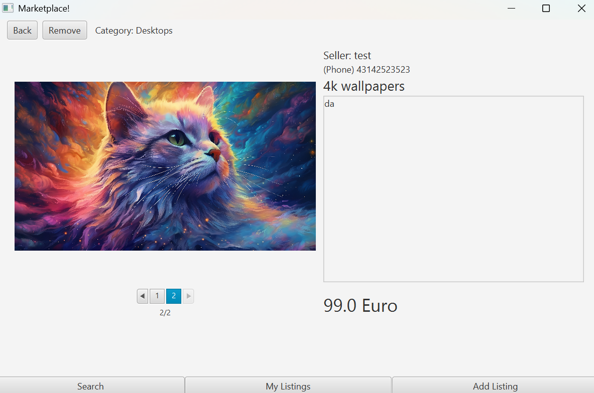
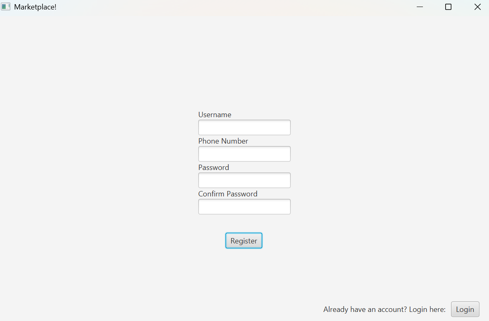
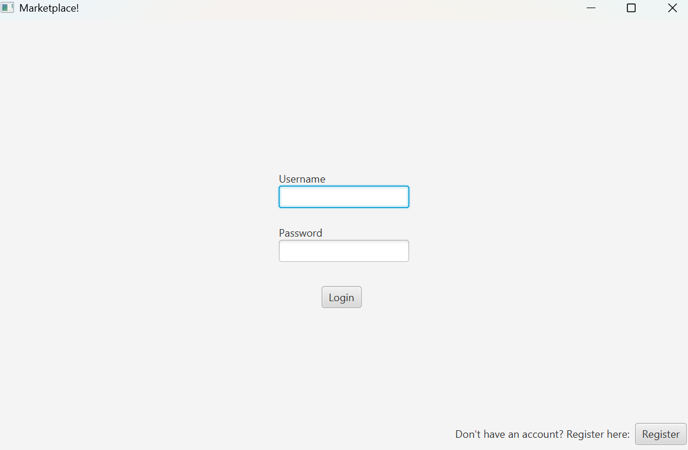
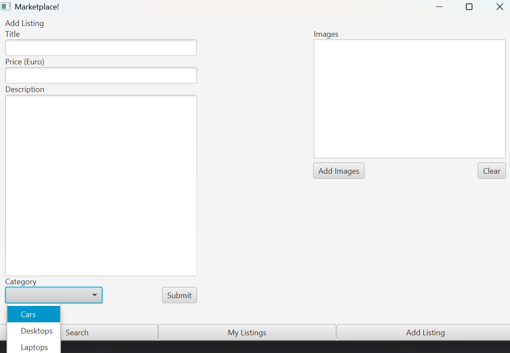
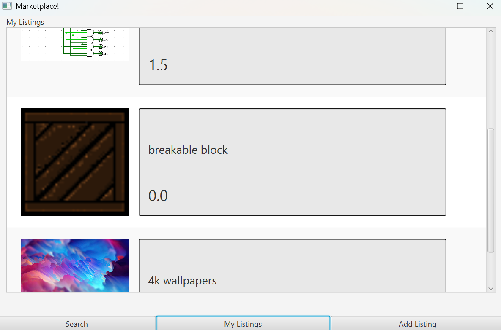
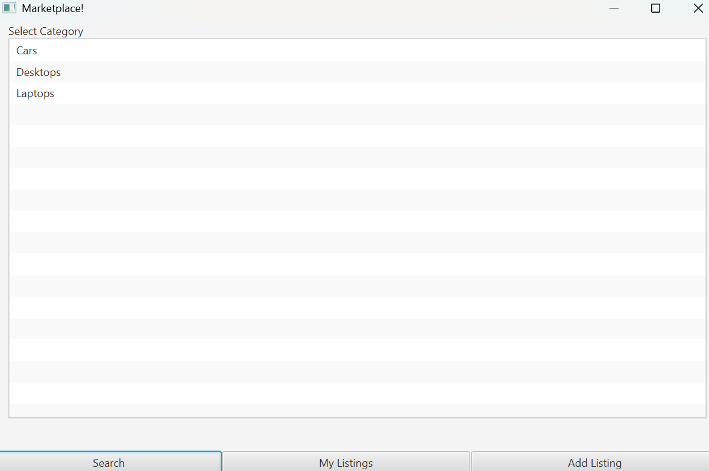

### 🛒 Marketplace App (Java, Maven, PostgreSQL, JavaFX)

#### Overview  
This is a **client-server Marketplace App** built in **Java (Maven)** with a **PostgreSQL** database, integrated with **Eclipse Jakarta Persistence**. Users can create or log into an account, search for listings, and add new product listings with images stored in the database. The app features a **modern GUI built with JavaFX** for an intuitive user experience.

#### 🔹 Features  
✅ **User Authentication**: Secure account creation and login.

✅ **Argon2 Password Hashing**: Ensures strong password security.  
  

✅ **Listing Management**: Add, edit, or remove product listings.  

✅ **Image Storage**: Upload and store product images in the database.  
✅ **Category-Based Search**: Find listings by category.

✅ **Optimized Search (Lazy Loading)**: Listings load dynamically while scrolling to prevent server/database overload. 
✅ **Concurrent Server**: Handles multiple client connections.  
✅ **Graphical User Interface**: Built with **JavaFX** for a smooth user experience.  

#### 🏦 Architecture  
- **Client-Server Model**: Uses **TCP sockets** for communication.  
- **PostgreSQL Database**: Stores user accounts, product listings, and images.  
- **Eclipse Jakarta Persistence**: Provides efficient ORM and database interaction.  

#### 🚀 Setup & Installation  
1. **Clone the Repository**  
2. **Import into IntelliJ IDEA** (or another Maven-supported IDE).  
3. **Restore the Database** using the provided `.sql` backup (schema only).  
4. **Manually Add Users**: Create at least one `USER` and one `ADMIN`.  
5. **Configure**  
   - Database authentication details.  
   - Addresses, ports, and paths in the server configuration.  
6. **Run the Project**  
   - Start the **server** first.  
   - Launch the **client** to interact with the marketplace.  

#### ⚠️ Important Notes  
- The repository **does not contain** sensitive details like **database credentials, addresses, or ports**—these must be configured manually.  
- The `.sql` backup only contains the **schema**, so you need to insert initial data.  

